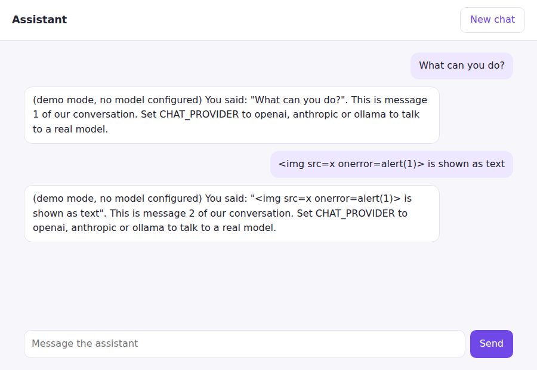

# Chat site

[](https://github.com/kartikey13kaushiq/chat_bot_site/actions/workflows/ci.yml)
  

An AI chat website that streams replies token by token from **any OpenAI-compatible API**
(OpenAI, Azure OpenAI, Groq, Together, Mistral, and local Ollama, vLLM or LM Studio) or from
**Anthropic**. It runs in demo mode with no API key at all.



## Features

- **Streaming.** The server relays model output as Server-Sent Events, and the browser renders
  each delta as it arrives. A *Stop* button aborts generation mid-answer.
- **Provider-agnostic.** A small `ChatProvider` interface sits between the site and the model.
  Adding a provider means implementing one async generator.
- **Stateless server.** The conversation lives in the browser (`localStorage`) and is sent with
  each request. Any number of instances can run behind a load balancer, and one visitor never
  sees another's chat. The original version kept a single global history shared by everyone.
- **Safe by default.**
  - The system prompt is set on the server. Clients cannot send a `system` role, so it cannot
    be overridden.
  - Message size and count are limited, and history is trimmed to a context budget, always
    starting on a user turn.
  - A per-IP token-bucket rate limit returns `429` with `Retry-After`.
  - Upstream errors become readable messages without leaking internals.
  - A strict CSP is set, and all text is rendered with `textContent`.

## Run it

```bash
pip install -e .
python -m chatsite                                  # demo mode, http://127.0.0.1:8000

CHAT_PROVIDER=openai OPENAI_API_KEY=sk-... CHAT_MODEL=gpt-4.1-mini python -m chatsite
CHAT_PROVIDER=anthropic ANTHROPIC_API_KEY=... CHAT_MODEL=claude-sonnet-5-5 python -m chatsite
CHAT_PROVIDER=ollama CHAT_MODEL=llama3.1 python -m chatsite        # local model, no key
CHAT_PROVIDER=openai-compatible CHAT_BASE_URL=https://api.groq.com/openai/v1 \
  CHAT_API_KEY=... CHAT_MODEL=llama-3.3-70b-versatile python -m chatsite
```

Docker: `docker build -t chatsite . && docker run -p 8000:8000 -e CHAT_PROVIDER=... chatsite`.

| Variable | Default | |
|---|---|---|
| `CHAT_PROVIDER` | `echo` | `echo`, `openai`, `openai-compatible`, `ollama`, `anthropic` |
| `CHAT_MODEL` | per provider | Model name |
| `CHAT_BASE_URL` | per provider | For OpenAI-compatible servers |
| `OPENAI_API_KEY` / `CHAT_API_KEY` / `ANTHROPIC_API_KEY` | | Credentials, read from the environment only |
| `CHAT_SYSTEM_PROMPT` | a short assistant persona | Server-side instructions |
| `CHAT_RATE_LIMIT_PER_MINUTE` | `20` | Messages per client IP |

## API

`POST /api/chat` with `{"messages": [{"role": "user" | "assistant", "content": "..."}]}`. The
last message must come from the user. The response is `text/event-stream`:

```text
data: {"delta": "Hel"}
data: {"delta": "lo!"}
data: {"done": true}
```

On failure the stream sends `event: error` with `data: {"message": "..."}`.

## Develop

```bash
pip install -e ".[dev]"
ruff check . && ruff format --check .
pytest           # 18 tests, no network: provider streams are mocked with httpx.MockTransport
```

The tests check:

- the wire format of both provider protocols, including the system prompt, auth headers, and
  ignoring `ping` and role-only chunks;
- error mapping: 401, 429, 5xx, network failures and in-stream errors;
- rejection of client `system` messages;
- rate limiting with refill and bounded memory;
- context trimming;
- that internal exceptions never reach users.

## History

Version 1 (2018) was a TensorFlow 0.12 / Python 2.7 seq2seq model trained on Twitter
conversations. Both runtimes are long past end of life, and the weights were hosted outside the
repository. It is preserved in the git history; see commit `cd58182`.

## License

[MIT](LICENSE)
